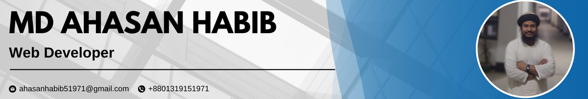

# Hi there, I'm Md Ahasan Habib 👋

### 👨‍💻 Passionate MERN Stack Front-End Developer  
**Turning ideas into interactive digital experiences**

## 👨‍💻 About Me

💼 **MERN Stack Front-End Developer**  
🎯 Specializing in building **responsive** and **high-performance** web applications  
💡 Skilled in **React.js**, **JavaScript (ES6+)**, and **Tailwind CSS**  
🚀 Focused on **clean code**, **scalability**, and **performance optimization**  
📚 Committed to **continuous learning** and **team collaboration**  

---

## 📌 Current Activities

- 🌱 Exploring **Next.js** and integrating it into real-world applications  
- 💻 Developing a **CMS project of a school** using **PostgreSQL**, **Prisma**, and **Next.js**  
- 📖 Expanding knowledge in **full-stack development** and database design
  
---

### 🛠️ Tech Stack

  
  
  
  
  
  
  
  
  
  

---

### 📫 Connect with me

  
  
  

---

### 📈 GitHub Stats

  

---

Thank you for visiting my profile! 😊
